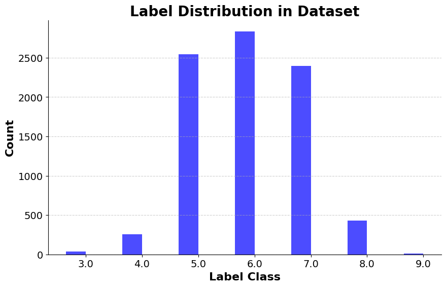

# Wine Quality Prediction

**Table of Contents:**

- [Wine Quality Prediction](#wine-quality-prediction)
  - [Authors](#authors)
  - [Overview](#overview)
  - [Project Structure](#project-structure)
  - [Prerequisites](#prerequisites)
  - [Getting Started](#getting-started)
    - [Installation](#installation)
  - [Model](#model)
    - [The dataset](#the-dataset)
  - [Communication](#communication)

## Authors

- [@CharrierTim](https://github.com/CharrierTim)
- [@H3Aether](https://github.com/H3Aether)

## Overview

An embedded AI project that aims to implement Wine Quality Prediction on the STM32L4R9AI platform.

## Project Structure

```bash
project-root/
│
├── dataset/
│ ├── wine_quality_X_test.npy
│ ├── wine_quality_Y_test.npy
│ └── winequalityN.csv
│
├── model/
│ ├── wine_quality_classifier.h5
│ └──
│
├── src/
│ ├── adversarial_example_attack.ipynb
| ├── algorithms_comparison.py
│ ├── communication_STM32.py
│ ├── dataset_handling.py
│ ├── wine_quality_classifier.ipynb
│ └── 
└── README.md
```

## Prerequisites

- [STM32CubeIDE](https://www.st.com/en/development-tools/stm32cubeide.html)
- [STM32CubeMX](https://www.st.com/en/development-tools/stm32cubemx.html)
- [Python 3.8](https://www.python.org/downloads/release/python-380/)

## Getting Started

Follow these steps to set up and run the project:

### Installation

1. Connect your STM32 development board to your computer.

2. Install the required Python packages: serial, numpy, csv, matplotlib and tensorflow

    ```bash
    pip install serial numpy csv matplotlib tensorflow
    ```

3. Open STM32CubeIDE and import the project.

4. Upload the project to your development board.

5. Run the Python script to start the prediction.

    ```bash
    python3 communication_STM32.py
    ```

Let's delve into the details of the model and the communication.

## Model

### The dataset

The objective of the dataset is to evaluate the quality of a wine based on 12 criteria such as acidity, sugar, pH... The result is a score between 3 and 9 (out of 10). But the dataset is not balanced, so we decided to reduce the number of categories. Here is the initial distribution of the scores:



To deal with this problem, we decided to augment to the dataset by adding new samples with random noise to the existing ones. You can find our own implementation of this method in `src/dataset_handling.py`.

For better results, we also reduced to 3 categories: bad, average, and good. Here is the new distribution after the remapping and data augmentation:


To handle the dataset, we created a Python Class called `Dataset` that can be found in `src/dataset_handling.py`. This class is used to load the dataset, format, split and augment it. Here is a UML diagram of the class:


## Communication