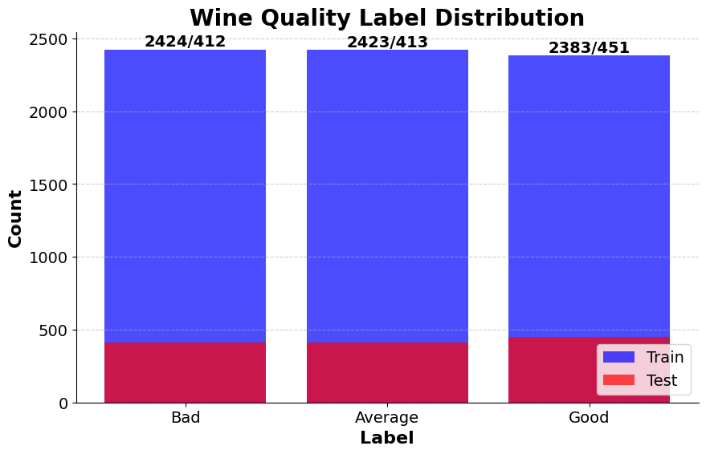

# Wine Quality Prediction

**Table of Contents:**

- [Wine Quality Prediction](#wine-quality-prediction)
  - [Authors](#authors)
  - [Overview](#overview)
  - [Project Structure](#project-structure)
  - [Prerequisites](#prerequisites)
  - [Getting Started](#getting-started)
    - [Installation](#installation)
  - [Model](#model)
    - [The dataset](#the-dataset)
    - [The model](#the-model)
    - [Communication with the STM32](#communication-with-the-stm32)
  - [The C code for the AI implementation](#the-c-code-for-the-ai-implementation)
    - [Syncronization](#syncronization)
    - [Acquiring and pre-processing the data](#acquiring-and-pre-processing-the-data)
    - [Post-processing the data](#post-processing-the-data)
  - [Results of the classifier](#results-of-the-classifier)
  - [Adversarial attack on the classifier](#adversarial-attack-on-the-classifier)

## Authors

- [@CharrierTim](https://github.com/CharrierTim)
- [@H3Aether](https://github.com/H3Aether)

## Overview

An embedded AI project that aims to implement Wine Quality Prediction on the STM32L4R9AI platform.

## Project Structure

```bash
project-root/
│
├── dataset/
│ ├── wine_quality_X_test.npy
│ ├── wine_quality_Y_test.npy
│ └── winequalityN.csv
│
├── model/
│ ├── wine_quality_classifier.h5
│ └──
│
├── src/
│ ├── adversarial_example_attack.ipynb
| ├── algorithms_comparison.py
│ ├── communication_STM32.py
│ ├── dataset_handling.py
│ ├── wine_quality_classifier.ipynb
│ └── 
└── README.md
```

## Prerequisites

- [STM32CubeIDE](https://www.st.com/en/development-tools/stm32cubeide.html)
- [STM32CubeMX](https://www.st.com/en/development-tools/stm32cubemx.html)
- [Python 3.8](https://www.python.org/downloads/release/python-380/)

## Getting Started

Follow these steps to set up and run the project:

### Installation

1. Connect your STM32 development board to your computer.

2. Install the required Python packages: serial, numpy, csv, matplotlib and tensorflow

    ```bash
    pip install serial numpy csv matplotlib tensorflow
    ```

3. Open STM32CubeIDE and import the project.

4. Upload the project to your development board.

5. Run the Python script to start the prediction.

    ```bash
    python3 communication_STM32.py
    ```

Let's delve into the details of the model and the communication.

## Model

### The dataset

The objective of the dataset is to evaluate the quality of a wine based on 12 criteria such as acidity, sugar, pH... The result is a score between 3 and 9 (out of 10). But the dataset is not balanced, so we decided to reduce the number of categories. Here is the initial distribution of the scores:


To deal with this problem, we decided to augment to the dataset by adding new samples with random noise to the existing ones. You can find our own implementation of this method in `src/dataset_handling.py`.

For better results, we also reduced to 3 categories: bad, average, and good. Here is the new distribution after the remapping and data augmentation:




To handle the dataset, we created a Python Class called `Dataset` that can be found in `src/dataset_handling.py`. This class is used to load the dataset, format, split and augment it. Here is a UML diagram of the class:


### The model

### Communication with the STM32

## The C code for the AI implementation

Implementing this classifier was done using Cube-AI pakage. We have to provide the model in .h5 format and the input and validation data in .npy format. Then, we wrote a C code to synchronize the STM32, pre and post processing the data and finally, the prediction.

### Syncronization

The synchronization is done using a simple handshake. The STM32 sends a byte with the value 0xAB and waits for the PC to send back 0xCD. Once the PC receives the 0xAB byte, it sends back 0xCD and the synchronization is done.

```c
#define SYNCHRONISATION 0xAB
#define ACKNOWLEDGE 0xCD

void synchronize_UART(void)
  {
    bool is_synced = 0;
    unsigned char rx[2] = {0};
    unsigned char tx[2] = {ACKNOWLEDGE, 0};

    while (!is_synced)
    {
      HAL_UART_Receive(&huart2, (uint8_t *)rx, sizeof(rx), TIMEOUT);

      if (rx[0] == SYNCHRONISATION)
      {
        HAL_UART_Transmit(&huart2, (uint8_t *)tx, sizeof(tx), TIMEOUT);
        is_synced = 1;
      }
    }

    return;
  }
```

### Acquiring and pre-processing the data

Acquiring the data is done using the HAL_UART_Receive function. The data is received as an array of bytes. We have to reconstruct the floats from the bytes (4 bytes per float). This reconstruction is done using the following code:

```c	
#define BYTES_IN_12_FLOATS 48

int acquire_and_process_data(ai_i8 *data[])
  {
    //
    // 1. Variables for data acquisition
    //

    unsigned char tmp[BYTES_IN_12_FLOATS] = {0};
    int num_elements = sizeof(tmp) / sizeof(tmp[0]);
    int num_floats = num_elements / 4;

    //
    // 2. Receive data from UART
    //

    HAL_StatusTypeDef status = HAL_UART_Receive(&huart2, (uint8_t *)tmp, sizeof(tmp), TIMEOUT);

    // Check the return status of HAL_UART_Receive
    if (status != HAL_OK)
    {
      printf("Failed to receive data from UART. Error code: %d\n", status);
      return (1);
    }

    //
    // 3. Reconstruct floats from bytes
    //

    if (num_elements % 4 != 0)
    {
      printf("The array length is not a multiple of 4 bytes. Cannot reconstruct floats.\n");
      return (1);
    }

    for (size_t i = 0; i < num_floats; i++)
    {
      unsigned char bytes[4] = {0};

      // Reconstruction of the bytes
      for (size_t j = 0; j < 4; j++)
      {
        bytes[j] = tmp[i * 4 + j];
      }

      // Store the bytes in 'data'
      for (size_t k = 0; k < 4; k++)
      {
        ((uint8_t *)data)[(i * 4 + k)] = bytes[k];
      }
    }

    return (0);
  }
```

Once the data is acquired, Cube-AI will run the model and return the prediction. The prediction is an array of 12 bytes representing 3 floats (i.e. the 3 categories). This is the role of the post-processing function.

### Post-processing the data

We decided to convert to floats and multiply by 255 to get the probability in uint8_t format (to only send one byte per category). By scaling the probabilities to the range [0, 255], we keep a precision of 0.4%, which is more than enough for our application.


This is done using the following code:

```c
  int post_process(ai_i8 *data[])
  {
    //
    // Get the output data
    //

    uint8_t *output = data;

    // An array to store the float outputs
    float outs[3] = {0.0};
    char outs_uint8[3] = {0};

    /* Convert the probability to float */
    for (size_t i = 0; i < 3; i++)
    {
      uint8_t temp[4] = {0};

      // Extract 4 bytes to reconstruct a float
      for (size_t j = 0; j < 4; j++)
      {
        temp[j] = output[i * 4 + j];
      }

      // Reconstruct the float from the bytes
      outs[i] = *(float *)&temp;
      outs_uint8[i] = (char)(outs[i] * 255);
    }

    //
    // Transmit the output data
    //

    HAL_UART_Transmit(&huart2, (uint8_t *)outs_uint8, sizeof(outs_uint8), TIMEOUT);

    return 0;
  }
```

Then, the PC can receive the prediction, convert it and compare it to the ground truth.

## Results of the classifier

## Adversarial attack on the classifier